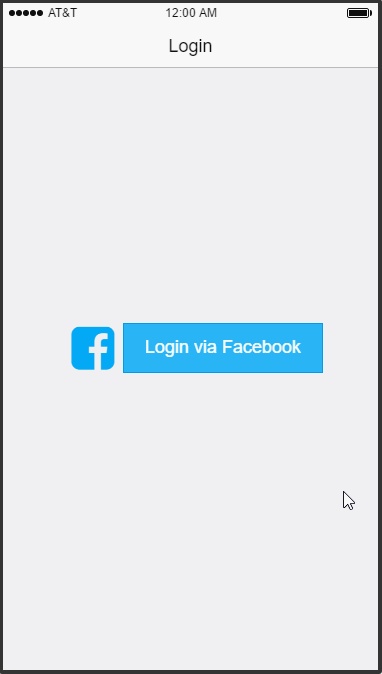

​
# Group Project - *ShareGroupLocation*
**ShareGroupLocation** is a social networking app specializing in group comunication. Using this app, user can share location, find perfect place for all members in group to meet up, or chat with group.
## User Stories
**Required** features:
### Login
- [x] User can sign up/sign in by email/password or use OAuth login flow (Facebook/Google).
- [x] The current signed in user will be persisted across restarts.

### User
- [x] Can edit profile (name, profile image, mobile number, change password).
- [ ] Can view pending invitations to join groups (Action: Accept, Decline).

### Group
- [x] View group list (in real time).
- [ ] View/edit group details (in real time).
   - [ ] Add/remove group members.
   - [ ] Leave group.
- [ ] User can create new group.
   - [ ] Group name.
   - [ ] Add group members using system contacts: if the contact number is registered then send invitation to join group (in app).
   
### Group Map
- [x] Show members location, group location on map view (real time).
   - [x] Scale the map view to see all online member locations.
- [ ] Group creater can edit group location:
   - [x] By pinning on map view (show suggested places).
   - [x] By selecting place from search page.
- [x] Show route direction to group (for current user).

**Optional** features:

### Login
- [ ] User can login with mobile number.

### User
- [ ] Can send app invite to friends.
- [ ] Private chat.

### Group
- [ ] Group chat.
- [ ] Add group members using system contacts: if the contact number is NOT registered then send invitation by iMessage.
- [ ] Can sync Facebook friends (or Google contacts) to system contact.

### Group Map
- [x] Show estimate time to arrive for each member.
- [ ] User can update in group status (Ex: I'm already here, I'll be late for ..., Sorry, couldn't make it, ...)

## Wireframe:

Here's a walkthrough of the app wireframe:

## App Survey Result:

https://docs.google.com/forms/d/1SmK7uBspaH23wReSyJGkhL7-9xrcW4uppJv87b3A4gA/viewanalytics

## Libraries:
- FireBase
- AFNetworking
- MBProgressHUD

## Video Walkthrough

Here's a walkthrough of implemented user stories:

## License
Copyright [2016] [TDTGroup]
Licensed under the Apache License, Version 2.0 (the "License");
you may not use this file except in compliance with the License.
You may obtain a copy of the License at
http://www.apache.org/licenses/LICENSE-2.0
Unless required by applicable law or agreed to in writing, software
distributed under the License is distributed on an "AS IS" BASIS,
WITHOUT WARRANTIES OR CONDITIONS OF ANY KIND, either express or implied.
See the License for the specific language governing permissions and
limitations under the License.
